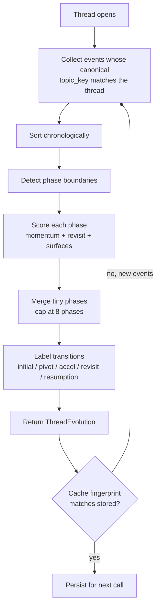

A [memory thread](/architecture/threading) carries the *identity* of
an evolving topic. **Evolution** answers the next question: *how did
the thread change over time?*

Real work doesn't sit still. A healthcare-startup idea begins as
articles and chats, becomes a folder of notes, gets stuck on legal
research, comes back two weeks later. A WebSocket-retry thread starts
with searching, moves to implementation, runs into a bug, and
eventually returns to documentation. Evolution exposes that
chronology — not as a chart, not as an analytics dashboard, but as a
small ordered list of phases the user can read in a glance.

```
events    →  raw capture                      (Phase 1A)
sessions  →  30-min temporal groupings        (Phase 1E)
contexts  →  topic-coherent sub-blocks        (Phase 1F)
resurfacing→ idle-launcher surfacing           (Phase 2B)
threads   →  persistent topic identity        (Phase 2C)
evolution →  phases inside a thread           (Phase 3A, this page)
```

## What a phase is

A **phase** is a coherent period of activity inside one thread. Each
phase carries:

| Field | Meaning |
|---|---|
| `id` | Deterministic — same input → same id |
| `thread_id` | The thread the phase belongs to |
| `title` | Human label (`Research`, `Implementation`, `Discussion`, `Revisit`, …) |
| `start_at`, `end_at` | Epoch seconds bounding the phase |
| `event_count` | Number of events in the slice |
| `dominant_surface` | Majority kind across the slice |
| `representative_queries` | Up to 3 distinct user-typed strings |
| `representative_targets` | Up to 6 distinct openable URLs / paths |
| `momentum_score` | Events per active hour, normalized to `[0, 1]` |
| `revisit_score` | Fraction of phase targets that appeared in *earlier* phases of the same thread |
| `transition` | How the phase *started* — `initial`, `continuation`, `acceleration`, `pivot`, `revisit`, `resumption` |
| `signals` | Per-signal contributions, for the debug overlay |
| `why` | Plain-English reasons, for the debug overlay |

Phases are not stored — they're derived from events on demand. The
optional `~/.recall/evolution.json` cache only avoids re-running the
segmentation on hover-rate calls; deleting it is safe.

## Lifecycle



There is no explicit "create phase" step. Boundaries fall where the
signals say they fall, and what's between them is a phase. If a
thread only carries a few events, the engine returns one phase
labelled `initial` — there isn't enough material to segment.

## Boundary detection

A boundary fires between events $N$ and $N+1$ when **any** of three
heuristics agrees:

### 1. Temporal gap

The interval between consecutive events exceeds an adaptive
threshold:

$$
\text{gap\_threshold} = \max\big(\,\text{24h},\ \ 6 \times \text{median inter-event interval}\,\big)
$$

A thread with daily cadence has a much wider notion of "long gap"
than one with hourly cadence; the median scaling keeps the threshold
in the right ballpark without a fixed knob.

When the gap is also more than `2×` the adaptive threshold, the
*next* phase additionally earns the transition label `resumption` (or
`revisit`, if its targets overlap earlier phases).

### 2. Surface-type shift

The dominant `kind` in the rolling 3-event window *before* event $N$
differs from the dominant kind *after*. The user moved from browsing
to coding, from chatting to file opens. Continuous in time, but
mentally a new mode.

### 3. Vocabulary shift

The Jaccard similarity of the content-token sets across the same
3-event rolling windows drops below 0.18. The user is still touching
the same topic key (otherwise this thread wouldn't exist), but the
specific concepts have moved on.

Heuristics 2 and 3 only fire when both rolling windows are full —
otherwise we'd invent boundaries near the start and end of every
thread.

## Phase titles

Titles are derived from the dominant surface, with two contextual
overrides:

| Dominant surface | Default title |
|---|---|
| `browser_visit` | `Reading` |
| `browser_search` | `Searching` |
| `chat_session` | `Discussion` |
| `open` / `reveal` | `Implementation` |
| `query` | `Looking up` |

Overrides:

- A phase that mixes `browser_visit` and `browser_search` reads as
  `Research`.
- A phase whose dominant surface is `open`/`reveal` *and* whose
  events concentrate on a single domain reads as `Iteration`.
- A phase whose `revisit_score` clears `0.5` is always labelled
  `Revisit`, regardless of dominant surface.

## Transitions

The `transition` field describes how a phase *began* relative to the
previous one. Ranked in priority order:

| Transition | Fires when |
|---|---|
| `initial` | First phase observed in the thread |
| `resumption` | The gap before this phase is longer than `2× gap_threshold` and `revisit_score < 0.5` |
| `revisit` | `revisit_score >= 0.5`, regardless of gap |
| `acceleration` | `momentum_score >= 0.4` *and* at least double the previous phase's |
| `pivot` | The dominant surface differs from the previous phase, but timing is continuous |
| `continuation` | None of the above |

The launcher's evolution strip colour-codes the hairline dividers
between phases by transition — *acceleration* in mint, *pivot* in
cyan, *revisit* in rose, *resumption* in amber, *initial /
continuation* in muted grey. The colour is the only visual signal;
there are no badges, no chart axes, no numbers on screen unless the
debug overlay is on.

## Momentum

$$
\text{momentum\_score} = \min\Big(1.0,\ \tfrac{\text{events per hour}}{4.0}\Big)
$$

Four events in an hour reads as full momentum. Sub-three-event
phases are capped so a single intense burst doesn't claim the full
score — momentum is meant to express *sustained* activity.

## Revisit

$$
\text{revisit\_score} = \frac{|\text{phase targets}\ \cap\ \text{earlier targets}|}{|\text{phase targets}|}
$$

`Earlier targets` is the running union of every URL / path observed
in *previous* phases of the same thread. So the first phase always
has `revisit_score = 0`; the third phase is asking *"of the things I
just clicked, how many had I clicked before in this thread?"*.

A `revisit_score >= 0.5` triggers the `Revisit` title and the
`revisit` transition.

## Dedupe and merge

After segmentation, the engine applies two passes:

1. **Tiny-phase merge.** A phase with fewer than 2 events folds into
   its closer neighbour by timestamp. Single-event boundaries are
   almost always stray.
2. **Adjacency dedupe.** If the result still has more than 8
   phases, the engine iteratively collapses the most similar
   adjacent pair (same dominant surface + short duration) until the
   count drops to 8. First and last phases are always preserved.

The 8-phase cap is a hard ceiling. A user-facing chronology with
more than that reads as a log dump, not a story.

## Determinism

Same events in → same phases out. Always. The engine:

- never randomizes
- never weighs signals adaptively beyond closed-form functions of
  the input
- never invents abandonment events; abandonment is detected purely
  from the gap signal
- never re-orders events; the chronology is the event log's
  chronology

This matters because the launcher caches phase ids
(`ph_<8 hex>` = hash of `thread_id + slot + start_ts`), and a fresh
rebuild on the same data has to produce the same ids — otherwise
the `~/.recall/evolution.json` cache would be wrong.

## API

| Method | Path | Purpose |
|---|---|---|
| `GET` | `/v1/threads/{id}/evolution` | Full chronology for one thread |
| `POST` | `/v1/threads/evolution/clear` | Wipe `~/.recall/evolution.json` |

`GET` returns the `ThreadEvolution` shape: `thread_id`, ordered
`phases`, `span_start` / `span_end`, and `elapsed_ms`. Unknown thread
ids return 404. When the engine is disabled
(`config.evolution_enabled = false` or Settings toggle off), the
endpoint also returns 404 so the launcher hides the strip cleanly
rather than render a half-baked surface.

## Performance

Smoke-test budget: **<70 ms median** on a 10K-event log. Measured
median sits around 35–45 ms. The dominant cost is the upstream
`threads.rebuild()` call (which already pays the EventStore parse
once and benefits from the per-event searchable-text cache); phase
segmentation itself runs in a millisecond or two on the few-dozen
events that filter through.

## Launcher integration

When the user clicks an "Active memory threads" digest row, the
launcher:

1. Types the thread's title into the search input — fires the
   existing retrieval pipeline (episodic + sessions + contexts).
2. Asynchronously fetches `/v1/threads/{id}/evolution`.
3. Renders the evolution as a one-line horizontal strip above the
   results pane. Pills carry the phase title + relative end time;
   dividers carry the transition colour cue; debug hover shows
   `why` lines verbatim when `RECALL_DEBUG=1`.

The strip clears automatically when the user clears the input or
opens a different thread. There is no separate "thread detail" view
— the search results below the strip are the thread's events,
ordered the same way.

## How evolution interacts with other layers

- **Threads** provide the identity; evolution reads `topic_key` and
  filters events through `ThreadBuilder._thread_key`. Disabling
  threads disables evolution too (no source).
- **Sessions / micro-contexts** are unchanged. They live at a
  different temporal scale — sessions are 30-minute groupings,
  micro-contexts split sessions; phases group *across* sessions.
- **Resurfacing** is independent. A phase that ends with a long
  inactivity gap may be the same topic resurfacing would surface,
  but the engines compute that separately.
- **Replay** does not consult evolution.

Evolution, like every layer above events, is purely derived. Delete
`~/.recall/evolution.json` and the next call produces the same
phases from the same events. The cache is an optimization, not a
source of truth.
