A temporal [session](/architecture/sessions) is 30 minutes of
contiguous activity. The user does not remember in 30-minute
chunks; they remember in *topics*. The micro-context reconstructor
splits one session into 2–6 sub-blocks so the launcher can answer
"what was I mentally working on?" rather than "what 30-minute window
am I looking at?"

## The split, by example

One real session might contain, in order:

1. Arxiv: RLHF paper
2. Google: "rlhf reward shaping"
3. towardsdatascience: Reward shaping in RL
4. The Atlantic: Kanye West interview
5. Forbes: Kanye West profile
6. Local file: `pitch_deck.pdf`
7. ChatGPT: "Critique of my pitch deck"
8. YC blog: "How to write a pitch deck"

A naïve view collapses these into one "afternoon of work". The
micro-context layer recognises three distinct threads:

| Context | Events | Topic |
|---|---|---|
| 1 | 1, 2, 3 | `rlhf · reward` |
| 2 | 4, 5 | `kanye · west` |
| 3 | 6, 7, 8 | `pitch · deck` |

## Signals

Splitting is pure heuristic — no embeddings, no LLM. Four signals
contribute to whether a new event joins an existing context:

| Signal | Score | Why |
|---|---|---|
| Same domain | `+0.80` | Strong: revisiting the same site usually = same topic |
| Same file path | `+0.80` | Strong: the same document is the same work block |
| Synonym-expanded token Jaccard | `0 - 0.70` | Moderate: word overlap with `websocket ↔ websockets ↔ ws` etc. |
| Temporal adjacency `<60 s` | `+0.15` | Tiebreaker: close in time = probably same thread |
| Temporal adjacency `<300 s` | `+0.08` | Weaker tiebreaker |

The final affinity is `min(1.0, top_structural_signal + temporal_bonus)`.
Threshold to join: `0.20`. Below that, a new context opens
(capped at 6 per session).

## Algorithm

```mermaid
flowchart TD
    S[Session events&#40;chronological&#41;]
    S --> D[De-noise: drop same-URL reloads within 30 s]
    D --> L{Each event}
    L --> A[Phase A: domain or path<br/>match in any existing context?]
    A -- yes --> J[Join that context]
    A -- no --> T[Phase B: expand tokens via synonyms<br/>compute Jaccard against each context]
    T --> AF{Best affinity &#x2265; 0.20?}
    AF -- yes --> JJ[Join best context]
    AF -- no --> N[Open new context&#10;capped at 6]
    J --> M[Post-pass: merge singletons<br/>into nearest multi-event context<br/>if within 10 minutes]
    JJ --> M
    N --> M
    M --> R[2 - 6 MicroContexts]
```



## Phase-A / Phase-B split (the perf trick)

The full algorithm reads each event against every existing
context. Naïvely, that means computing the synonym-expanded
token set of each event up front, costing ~30 µs per event. For
a 5,000-event session that's 150 ms — over budget.

The fix exploits a real-world observation: the *strongest* signal
(domain match) is also the *cheapest* to compute. So the loop is
structured as two phases per event:

1. **Phase A** — `O(1)` hash lookup: does this event's domain
   already appear in any existing context's domain set? If yes,
   join that context immediately. Never compute tokens.

2. **Phase B** — only runs when Phase A misses across every
   context. Expand tokens via synonyms, walk each context, take
   the highest Jaccard + temporal-bonus score.

In a typical browsing session (most events have a domain), Phase A
catches almost every event. Phase B fires only at topic pivots —
maybe a dozen times in a 5,000-event input.

Combined with caching `Event.ts_epoch()` on the instance and a
fast manual ISO-8601 parser (`_fast_iso_to_epoch`), the result is
a measured **34 ms for 5,000 events** on a 2020-era laptop. The
brief targeted &lt;50 ms.

## Protections against noise

Real activity logs are noisy. The reconstructor handles four
common failure modes explicitly:

| Failure mode | Protection |
|---|---|
| **Over-fragmentation** (every event opens a new context) | Hard cap: `MAX_CONTEXTS = 6` per session |
| **One-event contexts** (lone events left dangling) | Post-pass merges them into the temporally-nearest multi-event context, only when the gap is below 10 minutes |
| **Noisy tab-switching** (rapid URL changes) | De-noise drops same-URL reloads within 30 s |
| **Repeated reload events** | Same de-noise window catches them |

Each of these is exercised by the test suite in
`_smoke_microcontexts.py`.

## Surfacing

<Frame caption="A micro-context card collapsed (top) and expanded with up to five event sublines + Resume button (bottom). Replace with a real screenshot from your launcher.">
  
</Frame>

The launcher pre-allocates two micro-context rows between the
episodic and session layers. The visual order, top to bottom:

| Layer | What | Card style |
|---|---|---|
| Episodic event | "the specific moment" | Lavender / cyan / mint pill (kind tint) |
| **Micro-context** | "the topical thread" | Cyan `CONTEXT` pill |
| Session | "the broader work block" | Lavender `SESSION` pill |
| File | "the document" | File-type tag |

A collapsed context card is one line; the first `Enter` expands
it to show up to 5 event sublines + a "Resume context" button.
Resume reopens every URL/path inside the context.

## API

```python
from app.core.microcontexts import MicroContextReconstructor

reconstructor = MicroContextReconstructor()
contexts = reconstructor.reconstruct(session_events)
for ctx in contexts:
    print(ctx.label, ctx.event_count, ctx.time_label)
    for ev in ctx.preview_events(max_n=5):
        print(" ", ev.kind, ev.payload.get("title"))
```

The reconstructor is stateless — one instance can be reused across
every query. It does no I/O; it operates on whatever event list
you hand it.

## What this layer is not

- **Not topic clustering.** Clustering implies merging similar
  *contexts*; this layer only splits *within* a session.
  Cross-session merging is on the [roadmap](/roadmap).
- **Not a topic model.** No latent topics, no Dirichlet priors,
  no embeddings. Token Jaccard + domain match.
- **Not interactive.** The user never tells the system where the
  boundaries are. The launcher renders the split, the user picks
  the granularity by selecting episodic / context / session.
