A [thread](/architecture/threading) is the identity of an ongoing
concern. An [evolution](/architecture/evolution) is the chronology of
that concern. **Recovery** answers the question the user actually
asks Monday morning:

> *What should I open right now to keep going?*

Recovery is the first truly user-magical layer in Recall. The
launcher's `Continue where you left off` digest section is backed by
recovery; clicking a row opens every URL and file the user was using
when they stopped — one click, no narration.

```
events    →  raw capture                       (Phase 1A)
sessions  →  30-min temporal groupings         (Phase 1E)
contexts  →  topic-coherent sub-blocks         (Phase 1F)
resurfacing→ idle-launcher surfacing            (Phase 2B)
threads   →  persistent topic identity         (Phase 2C)
evolution →  chronological phases              (Phase 3A)
recovery  →  resumable work + one-click        (Phase 3B, this page)
```

## What a recovery candidate is

A `RecoveryCandidate` is the minimum coherent context to resume
thinking on one topic. It carries:

| Field | Meaning |
|---|---|
| `id` | Deterministic hash of `(thread_id, last_active_day)` |
| `thread_id` | The thread the candidate restores |
| `title` | Human label — same as the thread title |
| `last_active_at` | Epoch seconds, latest event in the thread |
| `continuity_score` | How *intact* the resume context is, `[0, 1]` |
| `recovery_confidence` | How *likely* the user wants to resume, `[0, 1]` |
| `representative_events` | Three newest events, deduped — preview |
| `suggested_targets` | One-click open list: `[(kind, target), …]`, capped at 8 |
| `related_sessions` | Recent `session_id`s involved |
| `related_contexts` | Reserved (currently 0) |
| `unresolved_signals` | Plain-English patterns: "reopened the same target N times", "abandoned mid-flow" |
| `signals` | Per-signal contributions, for the debug overlay |
| `why` | Plain-English reasons, for the debug overlay |

The two scores are independent on purpose. You can have an intact
context the user is done with (high continuity, low confidence). You
can have a fragmentary context the user desperately wants back (low
continuity, high confidence). The rank uses `max(continuity,
confidence)` so both routes to surfacing work.

## Lifecycle

```mermaid
graph LR
    A[Launcher opens idle] --> B[GET /v1/recovery/recent?n=3]
    B --> C[Threads.rebuild → top 6 active threads]
    C --> D[For each: Evolution.build → last phase]
    D --> E[Score continuity + recovery_confidence]
    E --> F{max score ≥ 0.40?}
    F -- no --> G[Suppressed]
    F -- yes --> H[Surfaced]
    H --> I[Rank by max score, return top 3]
    I --> J[Launcher renders RecoveryRow]
    J --> K[User clicks → one-click restore]
    K --> L[POST /v1/recovery/&#123;id&#125;/restore]
    L --> M[Launcher iterates suggested_targets,<br>opens each via OS]
```



There is no persistent on-disk recovery cache. A candidate is the
*current* recoverable shape, not history. Caching would surface
stale "restore me" cards.

## Continuity scoring

How *intact* is the resume context? Five components, weights sum to
~1.0, no clamping:

| Weight | Signal |
|---|---|
| 0.30 | **Recency** — exp decay, half-life 3.5 days |
| 0.25 | **Target reuse** — does the same URL/path recur within the thread? |
| 0.15 | **Surface breadth** — browser + files + chat = richer context |
| 0.15 | **Density** — events per active hour across the last 48 h |
| 0.15 | **Last momentum** — momentum score of the last evolution phase |

The recency half-life is sharper than the threads layer's because
recovery cares specifically about *recent* abandonment. A thread
that hasn't seen activity in two weeks is "set aside", not
"interrupted" — surface it via resurfacing, not recovery.

## Recovery confidence

Does the user *want* to resume? Four components:

| Weight | Signal |
|---|---|
| 0.35 | **Abandonment** — high momentum, then a gap of 6 h – 7 days |
| 0.30 | **Revisit** — last phase had a `revisit` transition (or `resumption`, half-weight) |
| 0.20 | **Acceleration** — last phase was an `acceleration` |
| 0.15 | **Unresolved pattern** — repeated opens (≥3) or repeated searches (≥2) |

The **abandonment signal** is the heart of the heuristic. It fires
when:

1. The last evolution phase carried real momentum (≥ 0.4), **and**
2. The thread has been idle for some time (gap ≥ 6 h), **but**
3. Not too long (gap < 7 days).

The 6 h floor avoids surfacing work the user is still mid-flow on.
The 7 d ceiling avoids surfacing work the user has clearly set
aside. The peak is around 24 h — the most recoverable gap is
overnight + the next day. After that, the signal tapers linearly
to zero at the week mark.

## Anti-noise

Hard ceiling: **3 candidates**. The brief is explicit, and the
launcher honours it. A list of resumable work wider than three is
no longer "the next thing to do", it's an inbox — which the brief
equally explicitly forbids.

Suppressions, tightened in Phase 3C:

- **Trivial work**: total events `< 4` → not a thread the user was
  "doing work in".
- **Single-surface work**: only one event kind in play, and total
  events `< 6` → passive read, not active work.
- **Passive consumption** *(Phase 3C)*: zero `open` / `reveal` /
  `chat_session` / `browser_search` events → reading material, not
  active work. The depth filter is the strongest single
  false-positive suppressor; it sends shallow browsing through
  resurfacing instead.
- **Stuck on one thing** *(Phase 3C)*: fewer than 2 distinct
  openable targets → "stuck on one page", not "in the middle of
  multi-source work".
- **Old work**: `last_active_at` more than 14 days ago → surface via
  resurfacing, not recovery.
- **Empty targets**: no openable URL or path in the thread → nothing
  to one-click.
- **Low confidence** *(tightened in Phase 3C)*:
  `max(continuity, confidence) < 0.45` (up from 0.40) → the
  surface is empty rather than fabricated.

## Preview caption (Phase 3C)

Every candidate carries a deterministic `preview_caption` the
launcher renders directly under the title:

```
3 tabs · 2 files · 1 chat · last active during implementation
4 tabs · last active during research
2 files · 1 chat · after a revisit
```

The caption is built entirely from:

- counts of suggested targets bucketed into `tabs`, `files`,
  `chats`
- the name of the last evolution phase (lower-cased), with two
  special-cased transitions:
  - `revisit` → "after a revisit"
  - `looking up` → "after a launcher search"

**No AI prose. No LLM summary. No generated metaphors.** Same
candidate inputs produce the same caption byte-for-byte, every
time. The deterministic guarantee is what makes the surface
trustworthy enough for the user to act on without a second
glance.

## One-click restoration

Clicking a `RecoveryRow` in the launcher fires this flow:

1. Launcher calls `POST /v1/recovery/{id}/restore`.
2. The service rebuilds the candidate pool, finds the matching id,
   and returns a `RestorationPlan`: an ordered list of
   `RestorationStep` entries plus the same `preview_caption` the
   row already displayed.
3. The launcher walks `plan.steps` in order. Each target opens via
   the existing handler: URLs through the OS browser, file paths
   through `os.startfile` / `open` / `xdg-open`. File opens are
   logged to the event store so the next recovery pass sees the
   restoration as activity.
4. The launcher tracks a `RestorationResult` locally
   (`requested`, `restored`, `skipped[]`, `elapsed_ms`). The
   completion footer reports `Restored 4 of 5 · 1 skipped`;
   nothing leaves the machine.
5. After at least one successful open, the launcher hides itself
   — subsequent opens fire in the background.

The endpoint never opens anything itself. The launcher is the only
process with permission to talk to the OS shell; the API is a pure
data surface.

### Restoration choreography (Phase 3C)

The plan's step order is **not** the order the user touched the
targets. It's the order that produces the cleanest re-entry into
the mental room:

| # | Group | Why first |
|---|---|---|
| 1 | `files` | Local artifacts ground the work. Opening one is the most "where am I?" answer there is. |
| 2 | `chats` | The conversation that informed the work. Reading it after the file gives "what was I asking?" context. |
| 3 | `tabs` | Reading material to re-anchor context. Grouped by domain so the browser presents them as related. |
| 4 | `searches` | Repeated query URLs, last — useful but not the foundation of the resumed state. |

Within each group, targets are newest-first.

The classification is deterministic. URLs whose host matches
`claude.ai`, `chat.openai.com`, `chatgpt.com`, `gemini.google.com`,
`perplexity.ai`, or `poe.com` are *chats*. URLs whose path matches
`google.com/search`, `duckduckgo.com/?q=`, `bing.com/search`, or
`kagi.com/search` are *searches*. Everything else with `kind ==
"url"` is a tab; everything with `kind == "path"` is a file.

### `RECALL_EXPLAIN_RECOVERY=1` (debug mode)

When this env var is set at launcher startup, the launcher prints
the full `RestorationResult` to stdout after each restore — every
skipped target with its skip reason ("file no longer exists", "OS
open failed", exception class names). The launcher's footer flash
also surfaces the count of skips inline.

The flag is off by default. It is *additional to* `RECALL_DEBUG`,
which controls the hover overlays — a developer can flip
explain-recovery without flipping every other debug surface.

## Determinism

Same events in → same candidates out. The engine:

- never randomizes
- never weighs signals adaptively beyond closed-form functions of
  the input
- never invents "abandonment" — it's a function of the gap between
  the last phase's `end_at` and `now`
- never re-orders representative events

The candidate id (`rc_<10 hex>`) is a hash of `(thread_id,
last_active_day)`. A new event in the thread changes the last-
active day and therefore the id — this is intentional. A candidate
is *this* recovery state, not just *this* thread. The
representation changes when the underlying state does.

## API

| Method | Path | Purpose |
|---|---|---|
| `GET` | `/v1/recovery/recent?n=3` | Top-N recovery candidates, ranked by max score |
| `POST` | `/v1/recovery/{id}/restore` | Resolve one candidate and return its full target list |

`n` is enforced at the API layer with `Query(le=3)`. Asking for 20
returns 422.

When the engine is disabled (`config.recovery_enabled = false`
or Settings toggle off):
- `/v1/recovery/recent` returns `{"candidates": [], "elapsed_ms": 0.0}`.
- `/v1/recovery/{id}/restore` returns 404 for any id.

The launcher reads both as "the surface is empty" and hides the
section.

## Performance

Smoke-test budget: **<80 ms median** wall-clock on a 10K-event log.
Measured median sits around 35–45 ms. The dominant cost is the
upstream `threads.rebuild()` call (which already pays the
EventStore parse once and benefits from the per-`Event`
searchable-text cache that the retrieval pipeline already
populates); recovery scoring on the few-thread candidate pool adds
a millisecond or two.

A recovery call shortly after a search pays essentially nothing
extra for parsing — the shared EventStore cache is hot.

## How recovery interacts with the rest of the engine

- **Threads** provide the candidate pool. Disabling threads
  disables recovery too (no source).
- **Evolution** provides the last-phase momentum and transition
  signals. Disabling evolution shrinks recovery's confidence
  score (the abandonment + revisit + acceleration components
  all go to zero).
- **Resurfacing** is independent. A topic that's both resumable
  and "on your radar" surfaces in both lanes — the user sees it
  twice, which is fine because the actions differ (recovery
  restores; resurfacing reminds).
- **Live search** does not consult recovery. A query goes through
  the existing episodic + sessions + contexts pipeline; recovery
  identity does not influence ranking.

Recovery is intentionally additive. Disabling it via Settings
doesn't change any other behaviour; all prior phases keep working
identically. The launcher's idle digest collapses one section
when recovery is off; everything else stays put.
