This is the page that ties the whole system together. If you read
only one architecture page, read this one.

## End-to-end shape

```mermaid
flowchart TB
    K[User types in launcher]
    K --> DB[Debounce 90 ms]
    DB --> W[Worker thread]

    W --> FS[SearchEngine&#46;search&#10;ChromaDB cosine + boosts]
    W --> ER[EpisodicRetriever&#46;search&#10;keyword + synonym + fuzzy + recency]
    W --> SR[SessionReconstructor&#10;reconstruct_for_query]
    W --> MC[MicroContextReconstructor&#10;reconstruct]

    FS --> R[Render results]
    ER --> R
    SR --> R
    MC --> R

    R --> UI[Launcher list:&#10;1 episodic, 2 contexts, 2 sessions, N files]
```



The four lookups run on a single background thread and emit a
single signal back to the UI thread. The launcher updates all row
sets atomically — there is no flash-of-empty between layers.

## The five layers, in order of breadth

The launcher list reads top-down, narrowest to broadest:

| Layer | Source | What the row represents |
|---|---|---|
| **Episodic event** | `EpisodicRetriever` | A single matching moment (one URL visit, one chat) |
| **Micro-context** | `MicroContextReconstructor` over candidate sessions | A topical work block within a session |
| **Session** | `SessionReconstructor` | A 30-minute temporal block |
| **File** | `SearchEngine` (ChromaDB) | A document matching the query |

A user with a vague memory can pick the granularity they actually
have a handle on. The system never collapses these into a single
"results" list because they answer different questions.

## Layer 1 — Episodic retrieval

Three sub-stages, all keyword-based, no embeddings:

```
query
  ↓
parse_temporal       → ("the kanye article", TimeWindow yesterday)
parse_kind_hint      → ("the kanye article", KindHint kind=visit)
expand_tokens        → ["kanye", "ye", "article", "post", "piece", "writeup"]
  ↓
score every event in the 14-day window:
  +0.20 per content token in title
  +0.10 per content token elsewhere in payload
  +0.13 per fuzzy-matched title token (typo tolerance via difflib)
  +0.25 if event kind matches the hint
  +0.20 more if platform matches too
  +0.18 × 0.5^(age_days / 3.5) recency decay
  ↓
dedupe by URL and (domain, title-stem)
  ↓
top-N EpisodicResult objects
```

The thresholds and weights are all in
`_episodic.py` at module scope. They are tuned conservatively —
the system would rather show one strong match than three weak
ones.

## Layer 2 — Session reconstruction

Layered on top of episodic retrieval. The episodic layer finds
*moments*; the session layer aggregates those moments back into
the *temporal blocks* they belong to.

```
matching events
  ↓
group by session_id
  ↓
for each candidate session:
  pull ALL events from the log (not just matching ones)
  score = sum(matching_event_scores)
        + count_bonus (max +0.30)
        + diversity_bonus (max +0.18)
  ↓
top-N sessions, sorted by score
```

See [Sessions](/architecture/sessions) for the full algorithm.

## Layer 3 — Micro-context reconstruction

Layered on top of sessions. The session layer gives you "what
was I doing in this 30-minute window"; the micro-context layer
splits that window into the *topical threads* the user remembers
separately.

```
for each candidate session:
  ordered events
  ↓
  de-noise (drop same-URL reloads within 30 s)
  ↓
  greedy cluster:
    Phase A: domain/path match against existing contexts (O(1))
    Phase B (only on Phase-A miss):
      synonym-expanded token Jaccard
      + temporal adjacency bonus
  ↓
  post-pass: merge singletons into nearest multi-event context
  ↓
  2-6 MicroContext objects
  ↓
rank by how many EpisodicResult-matched events each context contains
top-N micro-contexts
```

See [Micro-contexts](/architecture/micro-contexts) for the full
algorithm and the perf trick that brings 5K events under 50 ms.

## Layer 4 — File search

A separate stack entirely:

```mermaid
flowchart LR
    Q[Query] --> EM[MiniLM encoder]
    EM --> V[Query vector]
    V --> C[ChromaDB HNSW&#10;cosine similarity]
    C --> RF[Raw file chunks&#10;top-k * 4]
    RF --> D[Dedup by file path]
    D --> B[Apply boosts:&#10;filename hits&#10;recency&#10;phrase match]
    B --> R[Final ranked file results]
```



File search uses real embeddings (the only place in Recall that
does). It runs in the same worker thread as the episodic
retriever, in parallel. Results are merged at render time into
the file-rows section of the launcher list.

## Timing budget

The launcher targets perceived-instant feedback. The full budget
per keystroke:

| Phase | Budget |
|---|---|
| Debounce | 90 ms |
| Worker dispatch + queued signal | <5 ms |
| File search (cold) | 80-200 ms |
| File search (warm) | <30 ms |
| Episodic retrieval (14-day window) | <20 ms |
| Session reconstruction (14-day window) | <30 ms |
| Micro-context reconstruction (per session) | <10 ms |
| UI render | <5 ms |
| **Total observable latency** | <100 ms typical, <300 ms cold |

A "Recalling…" footer state appears after 300 ms so the launcher
never feels frozen on a cold first query.

## Surfacing

<Frame caption="The launcher with all four layers visible: one episodic event at top, two micro-contexts, one session, and four file rows. Replace with a real screenshot.">
  
</Frame>

## Code entry point

The `Recall` facade in `app/__init__.py` wires everything together
for programmatic use. For the launcher itself, the entry point is
the `_SearchWorker.handle()` method:

```python
def handle(self, query: str) -> None:
    file_results     = self.engine.search(query, top_k=8)
    episodic_results = self.episodic.search(query, n=3)
    session_results  = self.sessions.reconstruct_for_query(query, n=2)
    context_results  = self._derive_contexts(session_results, episodic_results)
    self.finished.emit(query, file_results, episodic_results,
                       context_results, session_results)
```

Five lookups, one signal, one render. That's the entire pipeline.
