A session is a contiguous block of activity with no gap longer
than 30 minutes. Sessions are not stored — they are
*reconstructed* at query time by grouping events from the log.

## Concept

The launcher answers two distinct questions through the same
typing surface:

| Question | Returned layer |
|---|---|
| "Find X" | Episodic events + files |
| "What was I doing around X?" | **Sessions** + micro-contexts |

The sessions layer carries the broader context — every event in
the same temporal block as the matching one — so the user can
see what came before and after.

## Algorithm

```mermaid
flowchart TD
    Q[Query]
    Q --> E[EpisodicRetriever.search&#40;&#41;]
    E --> M[Matching events]
    M --> G[Group by session_id]
    G --> A[Aggregate score: sum of match scores<br/>+ count_bonus + diversity_bonus]
    G --> X[Enrich: fetch ALL events from log<br/>that share each session_id]
    A --> R[Top-N sessions, sorted]
    X --> R
    R --> T[derive_topic, derive_label, format_time_range]
    T --> S[Session objects]
```



The four phases in code:

```python
class SessionReconstructor:
    def reconstruct_for_query(self, query: str, n: int = 2) -> list[Session]:
        # 1. Episodic matches via the existing retriever
        matching = self.episodic_retriever.search(query, n=20)

        # 2. Group by session_id; aggregate the per-event scores
        per_session_score = defaultdict(float)
        per_session_matches = defaultdict(list)
        for r in matching:
            per_session_score[r.session_id] += r.score
            per_session_matches[r.session_id].append(...)

        # 3. Enrich: walk the log once, pulling every event
        # whose session_id is a candidate. This is the
        # "what was I doing" view — not just the matching
        # events but everything they sat alongside.
        candidate_sids = set(per_session_score.keys())
        all_events_by_sid = {sid: [] for sid in candidate_sids}
        for ev in self.event_store.iter_events(days=14):
            if ev.session_id in candidate_sids:
                all_events_by_sid[ev.session_id].append(ev)

        # 4. Score, label, sort, trim
        return top_n
```

## Scoring

A session's final score combines three signals:

| Component | Cap | Why it exists |
|---|---|---|
| Sum of matching episodic event scores | — | Base relevance: how strongly the user's query matched the events inside |
| `count_bonus`: `+0.08` per extra matching event | `+0.30` | Three hits in one session > three isolated hits elsewhere |
| `diversity_bonus`: `+0.06` per distinct event kind beyond the first | `+0.18` | A session that mixed search + chat + visit is richer context |

The minimum confidence floor is `0.40` — higher than the episodic
floor because aggregation has already happened.

## Topic + label generation

Heuristic, no models. Two passes:

```python
# 1. Frequency-count content tokens across every event's title /
#    query / path tail.
def derive_topic(events) -> str:
    counter = Counter()
    for ev in events:
        for field in ("title", "query", "text"):
            counter.update(_content_tokens(ev.payload.get(field) or ""))
    top = [t for t, _ in counter.most_common(2)]
    return " · ".join(top) or "Untitled session"

# 2. Pick a verb template based on the dominant event kind.
_LABEL_TEMPLATES = {
    "browser_search": "Researching",
    "chat_session":   "Chats about",
    "browser_visit":  "Reading about",
    "open":           "Working on",
    "reveal":         "Working on",
    "query":          "Looking for",
}
```

Examples from the existing test suite:

| Session composition | Label |
|---|---|
| Mostly searches about websocket retries | `Researching websocket · retry` |
| ChatGPT thread about RLHF | `Chats about rlhf · reward` |
| File opens on a pitch deck | `Working on pitch · deck` |

## Session preview

A `Session` object exposes:

```python
@dataclass
class Session:
    session_id: str
    events: list[Event]            # ALL events, chronological
    matching_events: list[Event]   # subset that matched the query
    topic: str                     # "rlhf · reward"
    label: str                     # "Researching rlhf · reward"
    time_label: str                # "2h ago  ·  ~25min"
    score: float

    def preview_events(max_n=6) -> list[Event]: ...
    def openable_targets() -> list[tuple[str, str]]: ...
```

`preview_events` returns the most recent six events with
URL-dedup + (kind, title-stem) dedup, so a session that reloaded
the same article twice doesn't waste a preview slot.

`openable_targets` returns the deduplicated list of URLs and
paths the "Continue this session" action will reopen.

## Surfacing

<Frame caption="A session card collapsed (top) and expanded (bottom). Replace with a real screenshot from your launcher.">
  
</Frame>

In the launcher, sessions are pre-allocated as two row slots that
sit between the micro-context layer and the file-results layer:

```
Launcher results list
├── 3 episodic-event rows   ← specific moments
├── 2 micro-context rows    ← topical work blocks
├── 2 session rows          ← broader temporal blocks  (this layer)
└── 8 file rows             ← documents
```

A collapsed session card is one line: pill + label + time + event
count. The first `Enter` expands it; the second `Enter` triggers
*Continue this session*, which reopens every URL and path inside.

## Performance

Reconstruction is two passes over the 14-day event log:

1. The episodic retriever's own pass (already amortised).
2. A second walk to enrich each candidate session.

Both are O(N) over the day-bounded log. For a 5,000-event window
this stays under 30 ms on a 2020-era laptop, well inside the
launcher's 90 ms debounce + 300 ms loading threshold.

Sessions are **never cached across queries** — a query change
re-ranks which sessions surface, and the candidate set is small
enough that a fresh reconstruction is cheaper than maintaining
cache invalidation logic.

## SessionTimelineCard (Phase 3C)

The launcher's `SessionTimelineCard` is the *visual language of
continuity*: a compact horizontal strip that renders a thread's
evolution as a sequence of phase pills connected by
transition-coloured segments. Five canonical transitions, each
with its own connector treatment:

| Transition | Connector |
|---|---|
| `acceleration` | solid mint |
| `pivot` | solid cyan |
| `revisit` | solid rose |
| `resumption` | dashed amber (the dash implies the gap) |
| `continuation` / `initial` | solid muted grey |

The widget is purely visual — no interaction beyond an optional
debug-mode tooltip per phase, no animation, no badges. The point
is to *show the user the shape of their own attention over time*,
not to entertain them with it. Same palette the landing page
uses; same names the architecture docs use; same shapes the
launcher itself uses in the evolution strip after opening a
thread. Surfaces are deliberately consistent.
