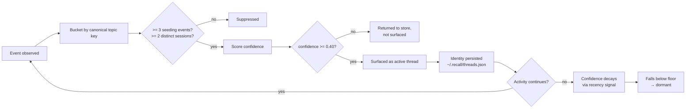

A **memory thread** is an evolving topic the user keeps returning
to over time. Healthcare-startup idea. WebSocket retry logic. RLHF
research. Kanye discography exploration. A thread is what makes the
user say *"I've been working on this for a while"* — not a session
boundary, not a single search query, but the persistent shape of an
ongoing concern.

Threads are the next abstraction layer in the engine:

```
events     →  raw capture                    (Phase 1A)
sessions   →  30-min temporal groupings      (Phase 1E)
contexts   →  topic-coherent sub-blocks      (Phase 1F)
resurfacing→  query-time idle surfacing      (Phase 2B)
threads    →  persistent topic continuity    (Phase 2C, this page)
```

Each layer composes on the previous one without rewriting it. The
threads engine reads the same per-day JSONL log every other layer
reads; the launcher's existing session and micro-context primitives
do the chronological reconstruction when you open a thread.

## What a thread is, and isn't

A thread **is**:

- a stable identity (`thr_<8 hex>` derived deterministically from the
  topic's canonical token);
- a confidence score in `[0, 1]` that strengthens with continued
  activity and decays naturally when activity stops;
- a small bundle of *representative* artifacts — the user's most-
  recent queries on the topic, the URLs and paths they kept opening,
  a human-readable timeline summary;
- a unification surface across **browser visits, searches, chat
  sessions, file opens, and launcher queries** — every place the user
  touched the topic flows into the same thread.

A thread is **not**:

- an LLM summary;
- a vector cluster;
- a recommendation;
- a notification.

Threads are deterministic. Same events in → same threads out, always.
No randomness, no learned weights, no probabilistic assignment. If a
topic doesn't show up as a thread today, you can re-derive *why* by
walking the same heuristics by hand.

## Lifecycle



There is no explicit "create thread" step. A topic that crosses the
threshold is, by definition, a thread; one that falls below it on
the next rebuild simply stops being surfaced. Identity (id +
`created_at` + title) persists in the cache so that if the same topic
returns weeks later, it picks up where it left off.

## Inputs the engine considers

| Signal | Where it comes from | Weight in confidence |
|---|---|---|
| **Span** | Days between first and last event on the topic | 0.20 |
| **Density** | Events per active day on the topic | 0.25 |
| **Surface diversity** | How many distinct event kinds participated | 0.15 |
| **Session diversity** | How many distinct `session_id`s | 0.20 |
| **Recency** | Exponential decay (half-life 7 days) from the most recent event | 0.20 |

All five components live in `[0, 1]` before weighting. The weights
sum to ~1.0 by design, so the final confidence lands in `[0, 1]`
without any clamping.

### Why these signals

These five are the smallest set that captures the difference between
*"a topic I've been working on"* and *"a thing I happened to touch
twice"*:

- **Span** rewards topics that are *durable* — a thread spread
  across two weeks is materially different from one compressed
  into a single afternoon.
- **Density** rewards topics with *intensity* without letting a
  burst dominate (the log shape caps the score).
- **Surface diversity** rewards topics that touch *multiple
  surfaces* — the user who has notes, a chat, and three open tabs
  about RLHF has a thread; the user who only has tabs probably
  doesn't yet.
- **Session diversity** is the hard floor: a topic confined to
  one session is *already* a session — promoting it to a thread
  would be vocabulary inflation.
- **Recency** is the decay axis. A two-week-old thread with no
  recent events has fading recency and slides below the surfacing
  floor naturally.

## Stabilization

Threads strengthen over time. That property comes from how the
engine treats *identity* versus *state*:

- **Identity** (id, topic_key, created_at, title) is persisted to
  `~/.recall/threads.json` and survives rebuilds. The first day
  the engine notices `websocket retry` becomes the thread's
  `created_at` forever — even if every event in the lookback window
  is from yesterday.
- **State** (confidence, event_count, session_count, surface_types,
  representative_queries, …) is recomputed from current events on
  every rebuild. There is no accumulation, no exponential moving
  average, no learned weight.

Stabilization is therefore a consequence of two things, both
deterministic:

1. As the thread accumulates events, more signals fire, and
   confidence rises naturally — a 14-day-old, 4-session, 12-event
   thread crosses 0.8 because every signal contributes.
2. As the thread persists, its `created_at` is "anchored" earlier
   in time, so the **span** signal compounds. A thread that's been
   alive for two weeks scores higher on span than one alive for
   two days, even with identical recent activity.

## Decay

Decay happens through the same mechanism, in reverse:

1. If no new events arrive, the **recency** signal decays
   exponentially with a 7-day half-life.
2. Events older than 30 days fall out of the lookback window
   entirely; the engine no longer sees them.
3. When a thread's confidence drops below `0.40` it is no longer
   returned from `recent`, but its identity row stays in the
   cache so a future return reactivates it with the original id.
4. The user can wipe the entire identity cache via Settings →
   *Clear thread cache*.

There is **no automatic deletion**. The engine never throws away
identity on its own — it only stops surfacing.

## Investigation coherence — session-anchored bucketing

A browser visit, a search, or a chat session names its topic in
its own text. A bare **file open does not** — it carries a
filename. Keying a file event off its filename made `backoff.py`
its own thread, severed from the WebSocket debugging it belonged
to: the human saw one investigation, the engine saw loose
artifacts.

Bucketing is therefore two passes (Phase 4H):

1. **Anchor each session.** Browser / search / chat events are
   bucketed by topic; each session is tagged with its dominant
   topic (a deterministic majority vote, ties broken
   lexicographically).
2. **Bucket every event.** A file `open` / `reveal` **bridges into
   its session's anchor topic** when one exists — so `backoff.py`
   opened inside a WebSocket session joins the WebSocket
   investigation. A file opened in a session with *no* anchor (a
   pure coding session, no browser activity) keeps its
   filename-derived key.

The bridge signal is **same-session co-occurrence** — work inside
one 30-minute window is one working context. It is deterministic
and local; no embeddings, no similarity model. Only file events
bridge, so two distinct browser topics sharing a session never
fuse. Consumers that need a thread's membership (recovery in
particular) read it from `events_for_topic()` — the *same*
bucketing — never by re-deriving keys per event. The calibration
fixtures live in
[`TRUST_FIXTURES_CONTINUITY.md`](https://github.com/kunalKumar-13/Recall-me).

## Dedupe and merge

Two threads that share more than 55% of their representative
target URLs fold into one — the higher-scoring one wins. This is
the fallback for the rare case where the synonym map (the same one
the episodic retriever uses) misses a pair like *kanye* / *ye*.
Most merges never get this far because the synonym table collapses
aliases to one canonical token *before* bucketing.

## Anti-noise rules

The engine refuses to surface:

- Topics with fewer than **3** seeding events in the lookback
  window. Three is the smallest signal that means *"the user keeps
  coming back"*.
- Topics confined to a **single session**. That's already a
  session; calling it a thread would be category confusion.
- Topics that score below the **0.40 confidence floor**.
- Topics keyed on **generic tokens** (`github`, `docs`, `google`,
  `search`, …) — these would collide unrelated activity.

## Open-thread flow

Clicking an "Active memory threads" row in the launcher's idle
digest types the thread's title into the input. The existing
retrieval pipeline answers, returning episodic moments, sessions,
and micro-contexts for that topic — that *is* the chronological
reconstruction. No separate UI for thread detail; the engine
already has one.

For programmatic use, `GET /v1/threads/{thread_id}` returns the
full bundle directly: the thread, its sessions (reconstructed from
the topic's events), its micro-contexts, and a flat newest-first
event list.

## API

| Method | Path | Purpose |
|---|---|---|
| `GET` | `/v1/threads/recent?n=6` | Top-N active threads, ranked by confidence |
| `GET` | `/v1/threads/{thread_id}` | One thread + reconstructed sessions + micro-contexts + flat event list |
| `POST` | `/v1/threads/cache/clear` | Wipe `~/.recall/threads.json` (Settings → *Clear thread cache*) |

All routes are loopback-only; the same security boundary as the
rest of the API.

## Storage

`~/.recall/threads.json` — JSON, schema versioned, hand-editable.
Contains identity rows only:

```json
{
  "schema_version": 1,
  "threads": [
    {
      "id": "thr_3a7b4f12",
      "topic_key": "websocket",
      "title": "WebSocket retry on disconnect — best practices",
      "created_at": 1747104822.1,
      "last_active_at": 1747363201.7,
      "muted": false
    }
  ]
}
```

Everything else is recomputed from events on every rebuild.
Deleting the file is safe: the next rebuild allocates fresh ids
from the current event log without losing any data.

## Performance

Smoke-test budget: **<50 ms** for a full rebuild on a 10,000-event
log. Measured median sits at ~30 ms server-side; the engine reuses
the EventStore's per-file parse cache and the per-`Event`
searchable-text cache that the retrieval pipeline already populates,
so a thread rebuild called shortly after a search pays nothing for
event parsing.

## How threads interact with the rest of the engine

- The **launcher's idle digest** surfaces threads at the top, above
  the *"Continue where you left off"* resurfacing section. Threads
  are higher-order, so they read first.
- **Live search** does not consult threads. A query goes through
  the existing episodic + sessions + contexts pipeline; thread
  identity does not influence ranking.
- **Resurfacing** is independent and may surface a topic that is
  also a thread. The two layers answer different questions
  (*"what should I notice now?"* vs *"what's the persistent shape
  of my work?"*) and a strong topic shows up in both.

Threads are intentionally additive. Disabling them via Settings or
via the `RECALL_API_PORT` environment doesn't change any other
behaviour; all prior phases keep working identically.
