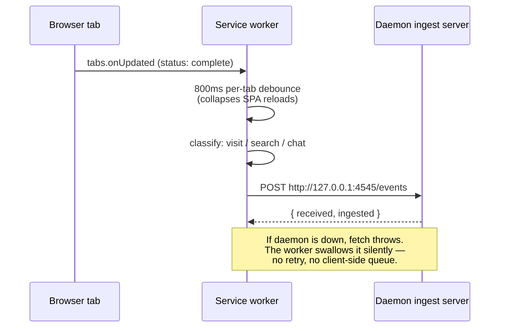

The Recall browser extension is a minimal MV3 service worker that
posts page metadata to the local Recall daemon. It ships in the
`extension/` folder of the main repo and can be loaded unpacked
in two minutes.

## What's in the box

```
extension/
├── manifest.json          # MV3 manifest — host_permissions = 127.0.0.1:4545
├── background.js          # service worker — tabs.onUpdated → POST /events
├── popup.html             # toolbar popup UI (~280 px wide)
├── popup.js               # popup ↔ chrome.storage + daemon health check
└── README.md              # standalone install notes
```

No build step. No bundler. No npm dependencies. The extension is
vanilla JS + JSON + HTML.

## Install (developer mode)

<Steps>
  <Step title="Start the desktop app">
    The daemon binds the ingest server on launch. In Settings →
    Browser Memory, confirm the listener line reads
    *Listening on 127.0.0.1:4545*. If it says *Server not
    running*, the port is in use by something else — see
    Troubleshooting below.
  </Step>
  <Step title="Open the extensions page">
    Chrome: `chrome://extensions`
    Edge: `edge://extensions`
    Brave / Arc / Vivaldi / Opera: each browser has its own
    chromium-prefixed page; same flow.
  </Step>
  <Step title="Enable Developer mode">
    Toggle in the top-right corner of the page.
  </Step>
  <Step title="Load unpacked">
    Click **Load unpacked** and select the `extension/` folder
    of the Recall repo.
  </Step>
  <Step title="Verify">
    Click the puzzle-piece icon in the toolbar, find Recall, pin
    it. Click the icon — the popup should say
    *Connected · N captured*.
  </Step>
</Steps>

## What gets captured

Three event kinds:

| URL pattern | Becomes |
|---|---|
| `chatgpt.com`, `chat.openai.com`, `claude.ai` | `chat_session` |
| Search-engine results (`google.com/search?q=...` etc.) | `browser_search` |
| Everything else | `browser_visit` |

Every event includes `url`, `title`, `domain`, `browser`, and a
UTC ISO-8601 `ts`. See [Events](/api/events) for the per-kind
payload shapes.

## What never gets captured

Hard-coded scheme blocklist (filtered both client-side and
server-side):

```
chrome:, chrome-extension:, chrome-search:, chrome-devtools:,
edge:, extension:, moz-extension:, about:, file:, data:, blob:,
view-source:, javascript:
```

Plus the user's domain exclude list (suffix-matched), plus
incognito tabs, plus anything posted while the popup or the
Settings toggle is paused.

## How it talks to the daemon



The 800 ms debounce is per-tab. A SPA that updates its URL three
times during navigation produces one event, not three.

## Popup

The popup is minimalist by design — two surfaces:

1. **Connection pill** — health check against
   `GET http://127.0.0.1:4545/health`. Green = daemon
   responding; red = daemon down. Includes the captured-event
   counter.
2. **Capture toggle** — pauses this browser specifically.
   Other browsers (if you run multiple with the extension
   installed) keep emitting.

The popup never reads any other URL. Its only network call is
the health check.

## Troubleshooting

### "Recall daemon not responding"

The desktop app isn't running, or its ingest server failed to
bind. Check:

1. Is the desktop app running? Look for the tray icon.
2. Is something else on port 4545? On Windows:
   `netstat -ano | findstr :4545`. On macOS/Linux:
   `lsof -i :4545`.
3. Did the boot log say `WARNING: browser ingestion server could
   not bind to 127.0.0.1:4545`? If yes, free the port or change
   `browser_ingest_port` in `~/.recall/config.json` (and update
   the extension's `host_permissions` to match — Chrome will
   make you re-load the unpacked extension after the change).

### Events not showing up in the launcher

1. Open the daemon's Settings → Browser Memory. Is the toggle
   *on*? Is the counter incrementing?
2. Open `~/.recall/events/$(date -u +%Y-%m-%d).jsonl` in a text
   editor. Recent browser visits should be there as JSONL lines.
3. If the file is updating but launcher results are stale, check
   that episodic capture is also enabled in Settings →
   Episodic Memory.

### Pages I want captured are dropping

Two filters can drop an event silently:

- A URL scheme on the blocklist (`file://`, `about:`, etc.) —
  by design, can't be overridden.
- A domain in the exclude list. Open Settings → Browser Memory
  → "Domains never captured" and remove it.

The daemon's `/health` endpoint exposes `dropped_total` so you
can confirm filters are firing.

## Development

The extension has no build step — edit, reload from the
`chrome://extensions` page, retest. A typical dev loop:

```bash
# In one terminal — the daemon
$env:RECALL_DEBUG=1; python recall.py     # PowerShell
# or
RECALL_DEBUG=1 python recall.py            # macOS/Linux

# Edit extension/background.js or extension/popup.js
# Reload from chrome://extensions (circular arrow icon)
# Open any normal page — the new behavior is live.
```

The service worker's console is reachable from
`chrome://extensions` → Recall card → *Inspect views: service
worker*. `console.log` in `background.js` shows up there.

## Manifest reference

The full `manifest.json`:

```json
{
  "manifest_version": 3,
  "name": "Recall.me — Memory Sync",
  "short_name": "Recall",
  "version": "1.1.0",
  "description": "...",
  "permissions": ["tabs", "storage"],
  "host_permissions": ["http://127.0.0.1:4545/*"],
  "background": { "service_worker": "background.js" },
  "action": {
    "default_popup": "popup.html",
    "default_title": "Recall Memory Sync"
  }
}
```

Two permissions:

- `tabs` — required for `tabs.onUpdated` and reading `tab.url` /
  `tab.title`. Does *not* allow reading page content.
- `storage` — used by the popup toggle and the exclude-list
  cache (`chrome.storage.local`).

No `<all_urls>`. No content scripts. No web-accessible
resources.

## Firefox / Safari

Not yet shipped. The manifest is MV3 + `chrome.tabs` APIs, which
Firefox supports — a one-day port to AMO is on the
[roadmap](/roadmap). Safari requires Apple Developer Program
membership plus an Xcode-built wrapper; not a Phase-1 problem.
