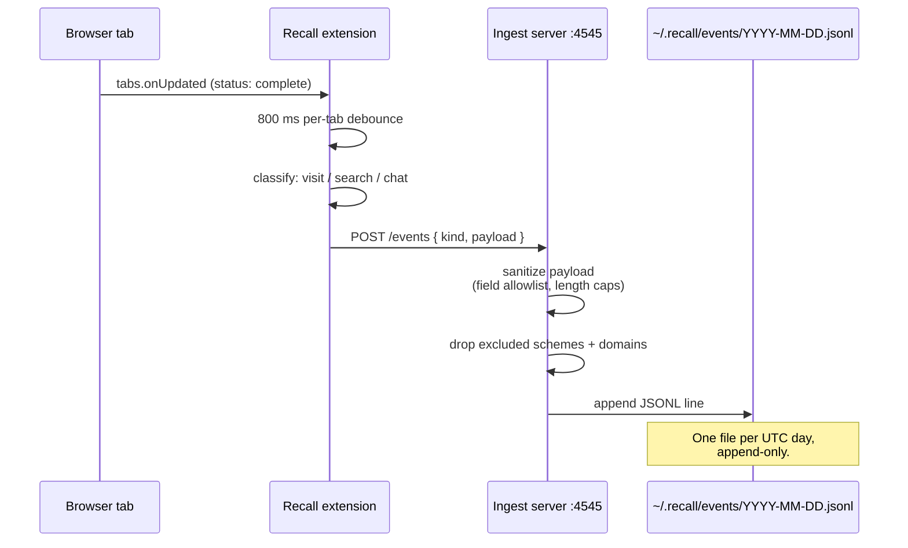

The browser is where most knowledge work happens. The browser
extension turns each completed page load, search-engine query,
and chat-platform session into a structured event posted to the
local Recall daemon.

## What gets captured

Three event kinds:

| URL pattern | Becomes |
|---|---|
| Anything else (`https://...`) | `browser_visit` |
| `google.com/search?q=...` (also DuckDuckGo, Bing, Kagi, Perplexity, You) | `browser_search` |
| `chatgpt.com`, `chat.openai.com`, `claude.ai` | `chat_session` |

Each event carries `url`, `title`, `domain`, `browser`, and a
UTC ISO-8601 `ts`. Search events also carry `engine` + `query`.
Chat events also carry `platform`.

## What does not get captured

The extension is intentionally narrow. It does **not** capture:

- Page content. The `tabs` API exposes URL + title metadata only.
- DOM elements, form values, cookies, localStorage.
- Pages from incognito / private windows (Chrome hides these
  from extensions; the extension also checks `tab.incognito`).
- Pages with these URL schemes:
  ```
  chrome://, chrome-extension://, chrome-search://,
  chrome-devtools://, edge://, extension://, about://,
  file://, data://, blob://, view-source://, javascript:
  ```
- Domains in your Settings → Browser Memory → "Domains never
  captured" list (suffix-matched: `google.com` filters
  `mail.google.com`, `docs.google.com`, etc.).

Scheme + exclude-list filtering happens both client-side
(extension) and server-side (ingest). The server filter is
authoritative.

## Architecture



Network surface:

- The extension's `host_permissions` is exactly
  `http://127.0.0.1:4545/*`. Chrome's permission system
  physically refuses any other fetch.
- The ingest server binds only to `127.0.0.1`. It is unreachable
  from any other machine on any network.

## Installation

<Steps>
  <Step title="Run the desktop app">
    Open Recall. The boot sequence prints `ingest server: running
    on 127.0.0.1:4545`. In Settings → Browser Memory the listener
    line should read *Listening on 127.0.0.1:4545*.
  </Step>
  <Step title="Open chrome://extensions">
    Or `edge://extensions` for Edge.
  </Step>
  <Step title="Enable Developer mode">
    Toggle in the top-right corner.
  </Step>
  <Step title="Load unpacked">
    Click **Load unpacked** and pick the `extension/` folder of
    the Recall repo.
  </Step>
  <Step title="Confirm">
    Click the toolbar icon. The popup should read
    *Connected · N captured*.
  </Step>
</Steps>

See [Chrome extension](/extensions/chrome-extension) for the full
guide including build notes and troubleshooting.

## Pausing capture

Two switches, in order of scope:

1. **Per-browser**: the extension popup has a toggle. Off = that
   browser stops emitting events. Other browsers (if you run
   multiple) keep emitting.
2. **System-wide**: Settings → Browser Memory → uncheck
   *Browser memory*. The ingest server keeps listening so the
   extension's health check still succeeds, but every incoming
   event is dropped server-side before it touches disk.

Existing event days are preserved through both toggles. To delete
captured browser events, use Settings → Browser Memory → **Forget
all browser events**. That rewrites each day file in place,
stripping only `browser_visit` / `browser_search` /
`chat_session` lines and leaving launcher events untouched.

## Schema

A representative event:

```json
{
  "ts": "2026-05-13T14:32:11Z",
  "session_id": "s_20260513_143211_004812",
  "kind": "browser_visit",
  "payload": {
    "url": "https://arxiv.org/abs/2203.02155",
    "title": "Training language models to follow instructions",
    "domain": "arxiv.org",
    "browser": "chrome"
  }
}
```

Lines are appended to today's file the moment the extension's
POST succeeds. There is no batching, no client-side queueing —
if the daemon is down, the extension drops the event silently and
the next page load is the next attempt.

## Privacy posture

<Note>
  Browser memory inherits every guarantee from
  [Privacy](/features/privacy). The summary:
</Note>

- Plain text on disk. Any text editor opens the log.
- One file per day. Forget a day = `unlink()`.
- No network code in the writer module — `events.py` imports
  only stdlib + `config.py`.
- Toggle is honored synchronously.
- Domain exclude list applies before write.

## How browser events surface in the launcher

When the user types a query, the [retrieval
pipeline](/architecture/retrieval-pipeline) ranks browser events
alongside file results in three places:

1. **Episodic cards** — one row per matching browser moment.
2. **Micro-context cards** — topical work blocks that may
   contain browser visits, searches, chats, AND file opens.
3. **Session cards** — broader temporal blocks the moments live
   inside.

<Frame caption="A launcher result list showing an episodic browser visit (top), a micro-context, a session, and file rows below. Replace with a real screenshot.">
  
</Frame>

Each browser-event row in the launcher is `Enter`-able. Hitting
`Enter` hands the URL to the system default browser via the OS
handler (`os.startfile` on Windows, `open` on macOS, `xdg-open`
on Linux).

## Limitations

| Limitation | Where it lives |
|---|---|
| Chrome / Edge / Chromium only | The MV3 manifest. Firefox port is a one-day job; not on the immediate roadmap. |
| No page content capture | By design. Re-enabling this would require a different permission model. |
| No tab-state restoration | "Resume context" reopens URLs into new tabs; it does not restore the previous tab order or scroll positions. |
| Single-user | The event log is one folder for one user. Multi-user is not on the roadmap. |
