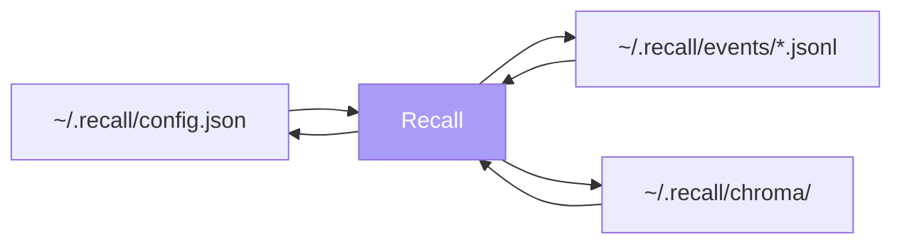

Recall does not have a privacy policy. It does not have one
because there is nothing about the user to have a policy on —
no accounts, no telemetry, no analytics, no remote server, no
third party in the picture at all.

This page documents how that's enforced in code.

## The five guarantees

<CardGroup cols={2}>
  <Card title="Local-first" icon="house">
    Every byte Recall records lives on the user's machine. The
    full memory of the system is the folder `~/.recall/`.
  </Card>
  <Card title="No telemetry" icon="signal-stream-slash">
    No analytics SDK, no error-reporting service, no usage
    metrics, no opt-in / opt-out toggle to fail on the wrong
    default.
  </Card>
  <Card title="Plain-text event logs" icon="file-lines">
    Every event is one JSON line in a daily JSONL file. Any
    text editor opens them; any user can audit them in seconds.
  </Card>
  <Card title="User-controlled deletion" icon="trash-can">
    Settings exposes three independent forget operations:
    last 24 hours, all activity, browser events only.
  </Card>
  <Card title="No cloud inference" icon="server">
    The only model in the runtime (the file-search embedder)
    runs on local CPU. There is no remote LLM, no remote ranker.
  </Card>
</CardGroup>

## What "structural" means

Each guarantee corresponds to a specific property of the
implementation, not a promise in a document:

### Local-first



The arrows above are the only data dependencies. There is no
remote backing store, no sync service, no cache layer that
shadows the local files. Deleting the `~/.recall/` folder
deletes the entire memory of the system.

### No telemetry

Verifiable in two steps:

```bash
# Search for any analytics/error-reporting imports
grep -RIn "sentry\|posthog\|amplitude\|segment\|mixpanel\|datadog" app/

# Search for any remote HTTP calls
grep -RIn "requests\.\|urllib\.\|httpx\.\|fetch(" app/
```

The first command returns nothing. The second returns only the
ingest server's *listener* (it binds to `127.0.0.1:4545`; it
never makes outbound calls) and the embedding model download
that happens once on first run.

### Plain-text event logs

The event log is JSONL. Each line is one event:

```json
{"ts":"2026-05-13T14:32:11Z","session_id":"s_...","kind":"browser_visit","payload":{...}}
```

To audit what Recall captured today:

```bash
cat ~/.recall/events/$(date -u +%Y-%m-%d).jsonl | jq .
```

To delete a specific event, open the file in any text editor and
delete the line. The system reads from these files freshly on
every query; manual edits take effect immediately.

### User-controlled deletion

Three independent operations exposed in Settings:

| Action | What it removes | Implementation |
|---|---|---|
| **Forget last 24 hours** | Events with `ts > now - 24h` across affected day files | Rewrites the file in place, keeping older lines |
| **Forget everything** | Every event file under `~/.recall/events/` | `unlink()` per file, base directory preserved |
| **Forget all browser events** | Only `browser_visit` / `browser_search` / `chat_session` lines; launcher events kept | Per-line filter + rewrite |

All three are confirmed with a dialog that names the data being
removed. There is no "soft delete" — removed events are gone
from disk immediately.

### No cloud inference

The only model that runs at all is
`sentence-transformers/all-MiniLM-L6-v2`, which is downloaded
once (~80 MB) from Hugging Face and loaded thereafter with
`local_files_only=True`. The model runs on your CPU. It is
80 MB; it is not a black box; it is open weights.

The retrieval layers above file search — episodic, sessions,
micro-contexts — use no model at all. They are pure Python
heuristics. See [Retrieval pipeline](/architecture/retrieval-pipeline).

## What an attacker would need

To compromise the privacy of a Recall installation, an attacker
needs **physical access to the user's disk**. There is no
remote attack surface:

- The ingest server binds to `127.0.0.1`. A process on the same
  machine could spam events, but a remote one cannot reach the
  port.
- The browser extension's `host_permissions` is exactly
  `http://127.0.0.1:4545/*`. Chrome's permission model
  physically refuses any other fetch from its service worker.
- There is no auth token because there's no remote endpoint to
  protect. Hostile local processes are out of scope for the
  threat model (they could just read the JSONL files directly).

For users in higher-threat-model situations (shared workstation,
malware, persistence-style attackers), the recommended posture
is filesystem-level encryption of `~/.recall/` — handled by the
OS, not by Recall.

## What Recall promises *not* to add

These are explicit non-goals:

- A remote sync service. (Multi-machine sync may be added later,
  but the source of truth will remain the local file.)
- A team-shared event log. (Sharing primitives, if built, will
  layer on the user's explicit export, not on cross-account
  read.)
- A "smart summary" feature that uploads activity. (Anything
  that calls an LLM will run locally or not run.)
- Account creation. (There is no Recall account, will never be.)

The implementation guarantees on this page are not contingent
on future product decisions. The local-first commitment is the
load-bearing decision; everything else follows from it.
