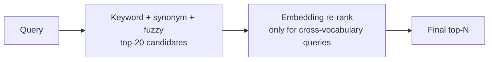

This is the public roadmap. Items here are sequenced — earlier
phases enable later ones, and none of them will compromise the
local-first commitment.

## Now

| Capability | Status |
|---|---|
| Local event log (Phase 1A) | Shipped |
| Browser ingestion + bundled extension (Phase 1B / 1D) | Shipped |
| Episodic retrieval — keyword + synonym + fuzzy + recency (Phase 1C) | Shipped |
| Session reconstruction (Phase 1E) | Shipped |
| Micro-context reconstruction (Phase 1F) | Shipped |
| Resume context / Continue session | Shipped |
| Settings: episodic toggle, browser toggle, three forget controls | Shipped |
| Chrome / Edge extension via Load Unpacked | Shipped |

## Next

### Embeddings as a second-pass re-ranker

The retrieval layer is keyword-first today — see
[Episodic memory](/philosophy/episodic-memory) for why. Embeddings
will layer on top of the existing pipeline, not replace it:



Embeddings will only run when the keyword stack returns weak
results — keeping the common-case latency unchanged. Local model
(MiniLM or similar), no remote inference.

### Passive resurfacing

Surface forgotten work proactively, with restraint:

- A daily *resurfaced* digest shown in the launcher's idle state
  (already a small section; will expand).
- Optional notification when a current activity strongly matches
  an old context the user hadn't touched in 30+ days.
- All notifications local, all opt-in, all dismissible.

This is the area most easily over-built. The product principle:
*if it would feel like spam from any other tool, it would feel
like spam here.*

### Cross-session context merging

A topic that spans multiple temporal sessions (you revisit RLHF
the next day) currently produces two unrelated micro-contexts —
one per parent session. Phase 1G will merge them:

```python
def merge_cross_session(contexts: list[MicroContext]) -> list[MicroContext]:
    # Cluster contexts whose topic-token sets share >= K tokens
    # AND whose temporal windows are within 7 days of each other.
    ...
```

The merged context exposes the union of every event, ordered by
timestamp. Resume reopens everything regardless of which day it
originally happened on.

### Plugin protocol

A way for users (and other apps) to write event sources that
look identical to the bundled ones:

```python
# A user-supplied "plugin"
from app.core.events import EventLogger

class GmailDraftPlugin:
    def __init__(self, logger: EventLogger):
        self.logger = logger

    def on_draft_saved(self, draft):
        self.logger.log("chat_session", {
            "url": draft.web_url,
            "title": draft.subject,
            "platform": "gmail",
            "browser": "gmail",
        })
```

Plugins run in-process; they are not sandboxed and not
remotely-loadable. The protocol is plain Python — no separate
plugin DSL.

### Local memory protocol

A loopback HTTP layer for retrieval, parallel to the existing
`/events` ingest:

```
GET    /search?q=...           # the launcher pipeline, but over HTTP
GET    /sessions/{id}          # full event list for a session
GET    /contexts?session={id}  # micro-contexts for a session
POST   /forget                 # forget by predicate
```

Same loopback-only constraint as `/events`. Will unblock
third-party clients (an Alfred workflow, a Raycast extension, an
emacs minibuffer surface) without requiring them to ship Python.

### Firefox / Safari extension

The MV3 manifest plus vanilla JS implementation already runs in
Firefox; ship to AMO is a one-day port and a review wait. Safari
needs an Xcode-built wrapper plus an Apple Developer Program
membership; lower priority.

## Later

These are tracked but not currently scheduled:

- **Multi-machine sync.** Encrypted, end-to-end, between
  installations of the same user. Source of truth remains the
  local file; sync is opt-in and resumable.
- **Topic-aware session boundaries.** Today's 30-minute gap
  heuristic groups events that should sometimes be split.
  Phase 1G's micro-context layer handles the split *after* the
  fact; the logger itself could split *during* capture.
- **OCR refinement.** OCR for screenshots works but quadruples
  first-run time. Needs a smarter trigger (screenshots-only,
  on-demand) before it ships on-by-default.
- **macOS / Linux launch-on-login.** Currently Windows-only via
  the registry. Linux `~/.config/autostart` is straightforward;
  macOS LaunchAgent needs careful work to play nicely with the
  Apple Hardened Runtime.

## Deliberate non-goals

These will *not* be added, regardless of how many requests come
in:

- **A cloud version.** The architecture would have to fundamentally
  change. The trade-off doesn't justify the rebuild.
- **An LLM chat layer over your data.** That product exists, lots
  of teams are building it. Recall is the layer underneath, not
  another instance of it.
- **A team-shared event log.** Sharing primitives, if added, will
  build on explicit per-context exports — never on cross-account
  read access.
- **An accounts system.** There is no Recall account. There won't
  be.
- **A web app.** The launcher is a desktop surface because
  episodic memory of a personal computer is, structurally, a
  desktop problem.
- **A mobile app.** Same reason.

## How to influence the order

Open an issue on
[GitHub](https://github.com/kunalKumar-13/Recall-me/issues) with
the use case and the workflow it would unblock. The roadmap is
worked in priority of *how many distinct workflows it enables*,
not in priority of upvote count — but a clear use case is the
strongest possible signal.
