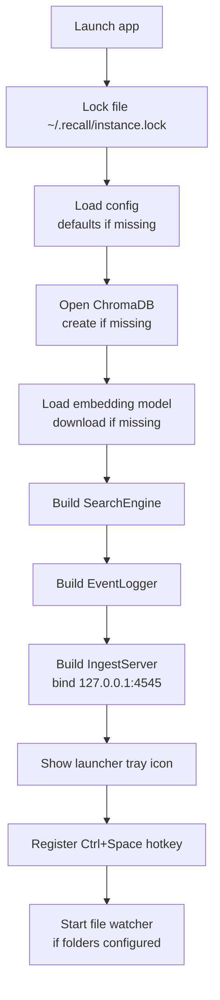

There is no cloud version of Recall to opt out of. The desktop
app is the daemon, the daemon is the entire backend, and every
byte of state lives in `~/.recall/`. "Self-hosting" here just
means *running the daemon* — there is no separate server tier.

## Requirements

| What | Minimum |
|---|---|
| OS | Windows 10, macOS 11, Ubuntu 20.04 (or equivalent Linux) |
| Python | 3.10+ (only if running from source) |
| Disk | 500 MB for the embedding model + index, more for a heavy event log |
| RAM | 500 MB resident, ~1 GB during initial indexing |
| Network | One-time download for the embedding model on first run. Fully offline thereafter. |

## Install

<Tabs>
  <Tab title="Prebuilt">
    Download the latest release for your platform from the
    [GitHub releases page](https://github.com/kunalKumar-13/Recall-me/releases/latest).
    Extract and run `Recall.exe` (Windows) or `Recall` (macOS,
    Linux). The first launch shows a one-page welcome that
    auto-suggests Documents and Desktop.
  </Tab>
  <Tab title="From source">
    ```bash
    git clone https://github.com/kunalKumar-13/Recall-me.git
    cd Recall-me
    python -m venv .venv
    .venv\Scripts\activate           # Windows
    # source .venv/bin/activate       # macOS / Linux
    pip install -r requirements.txt
    python recall.py
    ```

    Requires Python 3.10+. The first index pass downloads the
    embedding model (~80 MB) once into the Hugging Face cache;
    subsequent runs are fully offline.
  </Tab>
  <Tab title="Standalone build">
    ```bash
    pip install pyinstaller
    python scripts/build_icon.py     # writes app/assets/icon.ico
    pyinstaller recall.spec
    ```

    Output: `dist/Recall/Recall.exe` (Windows) or
    `dist/Recall/Recall` (macOS, Linux). Ship the whole
    `dist/Recall/` folder — it's self-contained.
  </Tab>
</Tabs>

## First-run flow



If a stage fails, the boot log prints which one. Set
`RECALL_DEBUG=1` to see per-stage timing.

## Layout on disk

After the first run, expect:

```
~/.recall/
├── config.json                         # folder list + toggles
├── instance.lock                       # PID of the running daemon
├── events/
│   ├── 2026-05-08.jsonl
│   ├── 2026-05-09.jsonl
│   └── 2026-05-13.jsonl                # today
├── chroma/                             # vector store
│   ├── chroma.sqlite3
│   └── ...
└── (optional) recall.log               # if RECALL_DEBUG was set
```

Delete `~/.recall/` to reset everything. Copy it to another
machine to transplant the memory.

## Keyboard shortcuts

The launcher is keyboard-first. The mouse exists for the tray
icon and a single button in Settings; every other action is
reachable from the home row.

| Shortcut | Action |
|---|---|
| `Ctrl + Space` | Toggle the launcher |
| `↑` / `↓` | Move selection across episodic, micro-context, session, and file rows |
| `Enter` | Open the file / URL / event |
| `Enter` (on a collapsed context or session card) | Expand the card |
| `Enter` (on an expanded context card) | **Resume context** — reopen every URL/path inside |
| `Enter` (on an expanded session card) | **Continue this session** — same, broader scope |
| `Ctrl + Enter` | Reveal the file in Explorer / Finder (file rows only) |
| `Ctrl + C` | Copy the file path / URL / session links |
| `Ctrl + M` | Copy a memory blob (title + why-matched + sources) for file rows |
| `Ctrl + ,` | Open Settings |
| `Esc` | Hide the launcher |

The tray menu adds:

- *Show launcher* — equivalent to `Ctrl + Space`
- *Settings* — equivalent to `Ctrl + ,`
- *Quit* — closes the daemon

## Boot diagnostics

`RECALL_DEBUG=1` makes the boot sequence print stage timing:

```bash
RECALL_DEBUG=1 python recall.py
# or
$env:RECALL_DEBUG=1; python recall.py
```

Stages print as `>> name` on entry and
`[OK]/[SLOW] name (Nms)` on exit. Failures print `[FAIL] name
(reason)` and continue (the daemon refuses to be silently
unhealthy).

In production mode, only failures and stages slower than one
second print. The rest is silent.

## Demo mode

```bash
RECALL_DEMO=1 python recall.py
# or
python recall.py --demo
```

Demo mode loads a curated in-memory dataset of ten sample
memories (healthcare-startup notes, RL research, websocket
production work, a few older pitches). No folders are scanned,
no embedding model is loaded, no ChromaDB writes happen.
Useful for screen recordings and live demos.

Try queries like *healthcare startup*, *websocket retry*,
*rl reward shaping*, *pediatric triage*.

## Headless / programmatic use

The same package that runs the GUI is importable as a Python
library:

```python
from app.core.events       import EventStore
from app.core.episodic     import EpisodicRetriever

store    = EventStore()
episodic = EpisodicRetriever(store)

for r in episodic.search("websocket retry yesterday", n=5):
    print(r.score, r.title, r.url)
```

See [SDK introduction](/sdk/introduction) for the full type
tour. There's no separate "headless mode" flag — the data is
just files; the readers don't need a running daemon.

## Updating

For prebuilt releases: download the latest, replace the binary.
The state in `~/.recall/` is forward-compatible — older payload
shapes are read by newer readers because the field allowlist
ignores unknown keys.

For source installs: `git pull && pip install -r requirements.txt`.
ChromaDB indexes are migration-safe between minor versions.
Major version bumps are documented in `CHANGELOG.md`.

## Backup

Two strategies, depending on what you care about:

| Strategy | Captures | Recovers |
|---|---|---|
| `cp -a ~/.recall ~/.recall.backup` | Everything | Full state, including file index |
| `cp -a ~/.recall/events ~/recall-events-backup` | Just the activity log | Activity history; the file index will rebuild itself on next launch if needed |

Both work because the entire memory is plain files. There is no
"export" feature in Settings because copying the folder is the
export feature.
